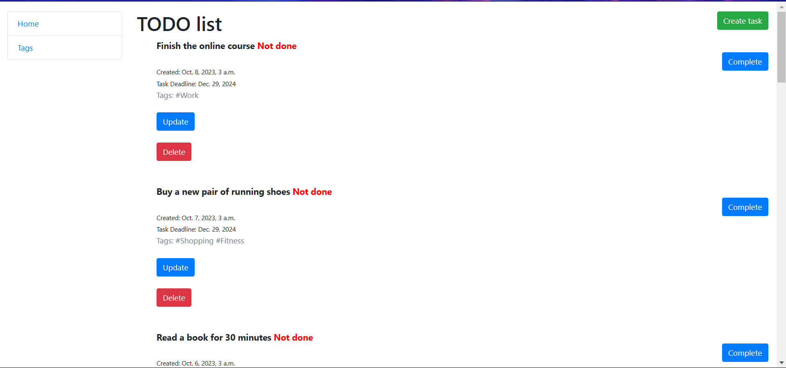
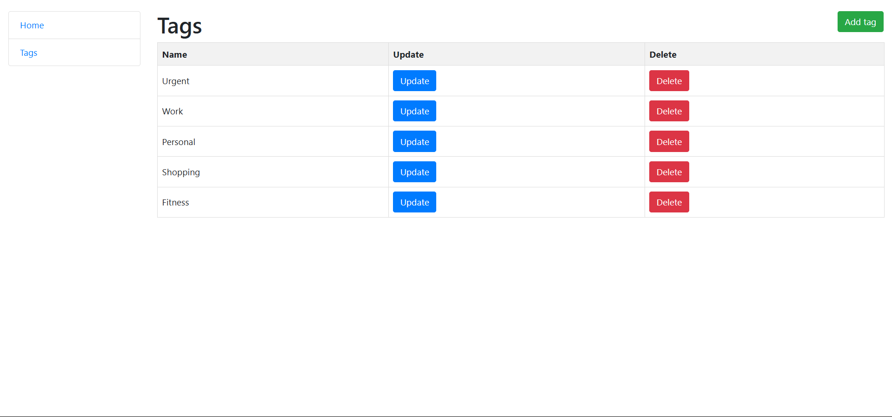

## Todo List Application
## Overview
This Todo List Application is a simple web-based tool designed to help users manage their tasks efficiently. It allows users to create, update, and delete tasks, as well as categorize them using tags. The application features a clean and user-friendly interface, making it easy to keep track of tasks and their statuses.

## Features
- Task Management: Users can create tasks with the following attributes:

  - Content: A description of the task.
  - Creation Date: The date and time when the task was created.
  - Deadline: An optional deadline for when the task should be completed.
  - Status: A boolean field indicating whether the task is done or not.
  - Tags: Relevant tags that can be associated with the task.
  - Tag Management: Users can create and manage tags that symbolize the theme of tasks. Tags can be associated with multiple tasks, and tasks can have multiple tags.

## User Interface:

- Home Page: Displays a list of tasks ordered from not done to done, and from newest to oldest. Each task includes options to update, delete, and change its status (Complete/Undo).
- Sidebar Navigation: Provides links to the Home Page, Tag List Page.
- Tag List Page: Displays a table of tags with options to update and delete them, along with a button to add new tags.

## Home & Tags pages

